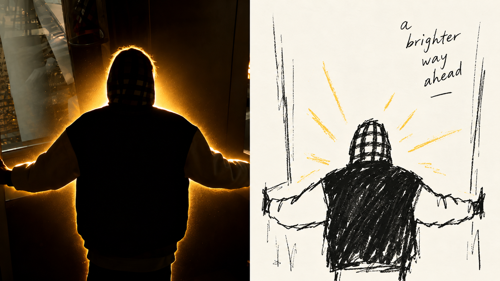
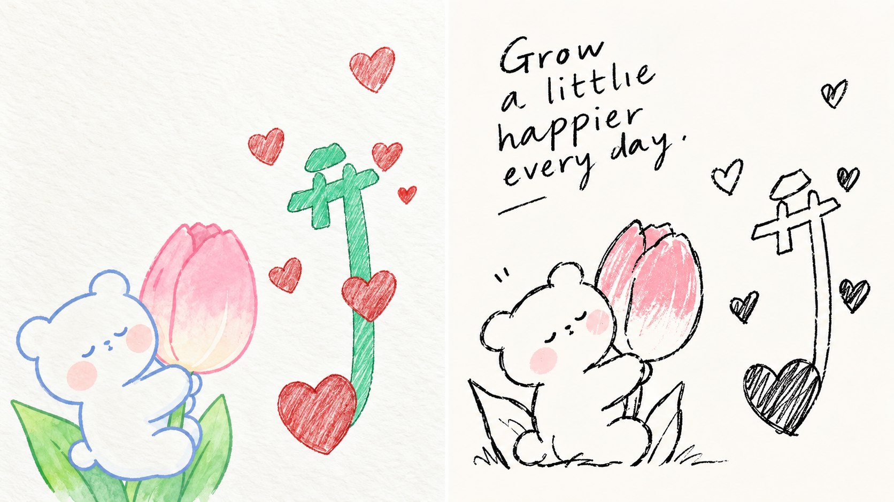
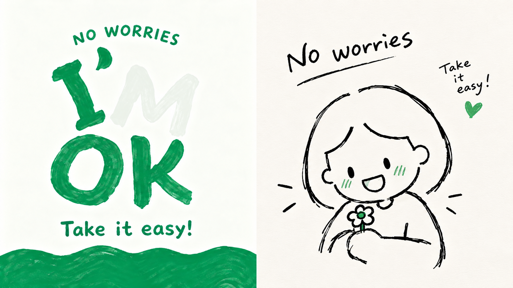
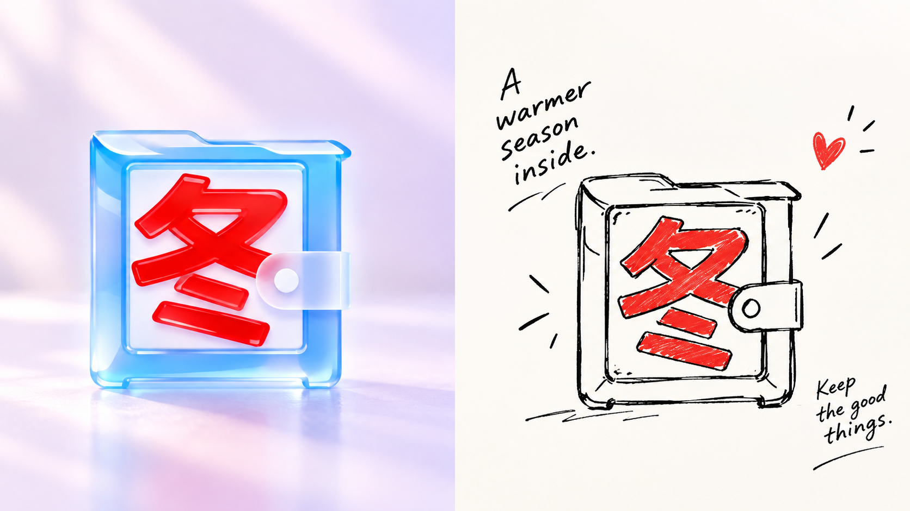
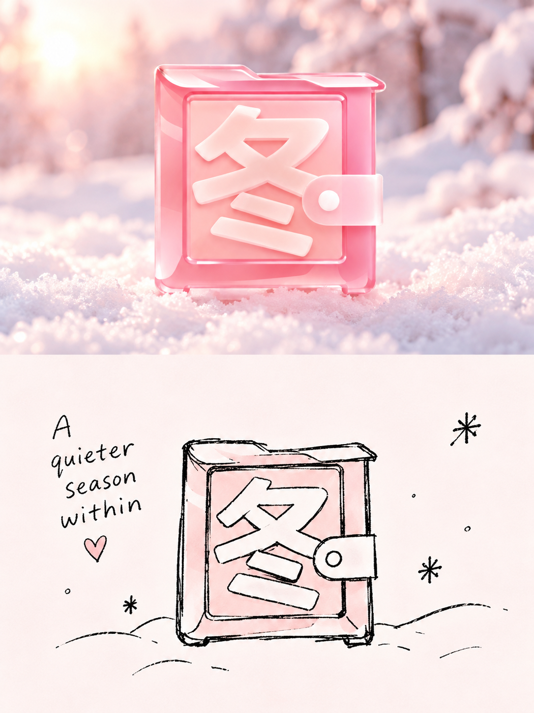
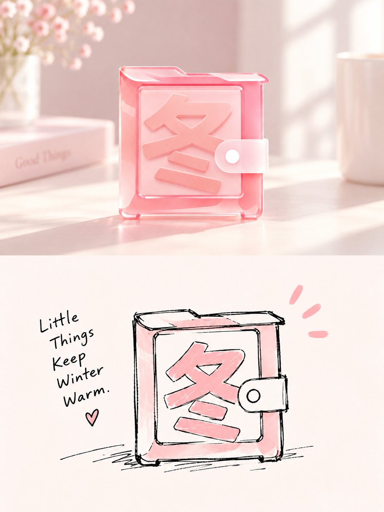
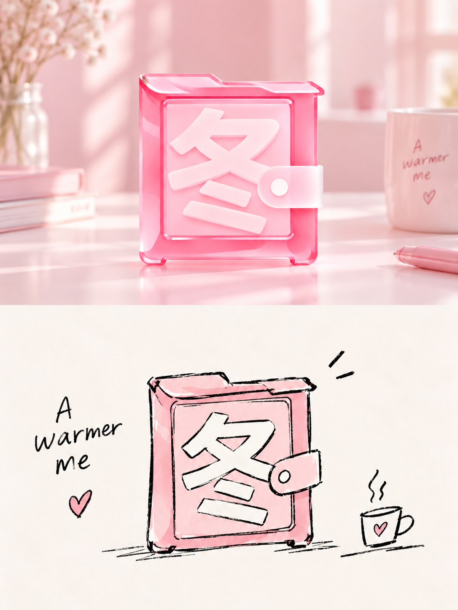

# 🦁 XXD Panel 062

### 사진의 스마트한 순간을 보존하려면 원본 이미지의 자연스러운 검정색 선과 강조 색상을 사용하세요.

<a href="README.md">简体中文</a> · <a href="README.en.md">English</a> · <a href="README.ja.md">日本語</a> · <a href="README.ko.md">한국어</a> · <a href="README.ar.md">العربية</a>

Panel 062는 복잡한 사진을 핵심 그래픽과 소수의 보조 기호로 압축합니다. 손으로 그린 ​​불안정한 검정색 선 그리기와 넓은 면적의 밝은 흰색 공간, 원본 이미지의 특징적인 색상을 사용하여 멀리서 보면 절제되고 가까이서 보면 친근한 편집 그림을 형성합니다.

**키워드:** 유치한 검정색 선 · 단일 악센트 색상 · 영리하고 서투른 · 매우 밝은 배경 · 편집 공백

## 사용

```text
/xxd-panel-062 photo.jpg --mode design-only --size 3:4 --text prompt --locale ko-KR
```

단일 이미지 또는 이미지 디렉토리, 4가지 출력 모드, 다양한 크기 및 3가지 텍스트 모드를 지원합니다. 전체 동작은 [SKILL.md](SKILL.md)를 참조하세요.

## 원본 프롬프트 · 5개 언어

[통합 다국어 카탈로그](references/original-prompt/) 열기: [중국어 간체 원본](references/original-prompt/zh-CN.md) · [영어](references/original-prompt/en.md) · [일본어](references/original-prompt/ja.md) · [한국어](references/original-prompt/ko.md) · [العربية](references/original-prompt/ar.md)

중국어 간체 파일은 사용자가 제공한 원본 텍스트를 그대로 저장하며 런타임 시 유일한 창의적이고 미적인 권위입니다. 다른 네 가지 버전은 충실한 읽기 번역으로, 해외 독자가 이해하고 전달할 수 있도록 편리하며 그림에 대한 프롬프트 단어를 다시 쓰지 않습니다.

원본 X 증명이나 출처는 현재 사용할 수 없으므로 `sample-01`–`04`는 유지됩니다. 아래에 새로 추가된 샘플은 모두 명확한 콘텐츠 소스 매핑을 가지고 있습니다. 자세한 내용은 [샘플 목록](assets/examples/README.md)를 참조하세요.

## 16:9 좌우 이중교정 추가

| | |
|---|---|
|  |  |
|  |  |

## 3:4 상하 이중교정 추가

| | |
|---|---|
|  |  |
|  |  |
